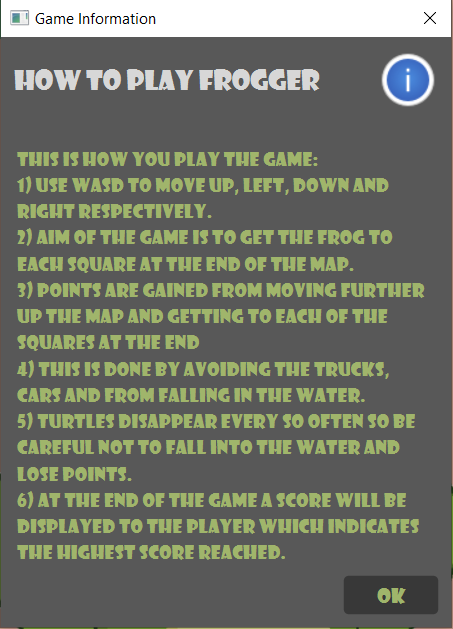
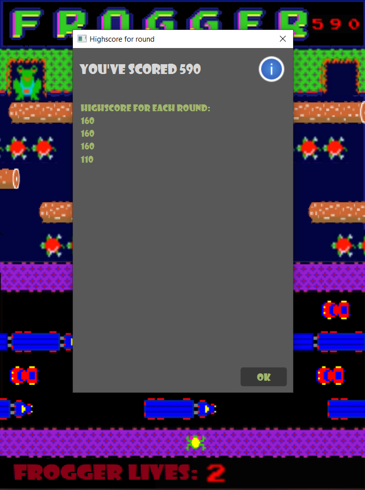

# **_Frogger Software Maintenance_**

This Program reintroduces an Arcade game called "Frogger". Although this version is similar to the orignal game they do differ as you will find additions in this version.

## Getting Started

These instructions ensure that the program load and run on your local machine for development and tests.

#### Running Frogger
~~~~
NOTE: not tested in command line as maven is integrated into IntelliJ

load the project into the IntelliJ IDE, and set the correct configurations.
This can be done by setting the Main class to com.mainPack.Main in
the "Edit Configurations" next to the run button and add a maven goal
in the build. Enter "clean compile test" to allow for automated testing
when running "Frogger".

Testing Environments:
    - Primarily on HP Envy
    - Labs

Versions used:
    - Java 10 
    - Maven
    - IntelliJ IDEA 2019.2.4 x64
~~~~

## Extensions

### Highscores
Highscores were implemented for the overall score of either level being played and displayed to the user in a sorted fashion (Descending). Made possible through the creation of a Highscore read/write class.

### Further Levels
Further level additions allowed once the "Main" was refactored to put the generic level implementation into an abstract class that could be overridden to alter the game.

Image displays the new level, having a bird added and each Turtle becoming a wetTurtle etc....

### JUnit
JUnit Tests created using testFX and include:
~~~~
1) Keypad press tested to see frogger moves properly
2) Checks objects in the game are set properly and move
3) Checks images are set properly for the objects
4) Tests points are set, added and removed appropriately
5) Read/Write are tested to see if they perform their actions 
   properly
6) Bubblesort in ordering highscores tested
7) Boundary tests
8) Checks water functionality - waterDeath
   etc..
~~~~
### Start Menu
"Start Menu" added to greet the user when they play the game. They can either choose a level or see the game rules by pressing "Game Information"

### Other Additions:
~~~~
1) Lives added
2) CSS added to alerts and buttons
3) Highscore at the end of each round displayed and sorted
~~~~

## Refactoring
### Maven
Maven build files allow for everything to be imported through maven and as such does not have any dependencies on source code outside its control. 
### Design Patterns
##### Singletons:
~~~~
1) Singleton added for the BackgroundImage class.
2) Singleton added for the HighScoreRW class to read/write highscores.
3) Singleton added for the StartMenu class as only created once and called 
   at the start and end.
~~~~
##### Factories:
~~~~
1) Factory added for Levels in the game.
2) Factory added for objects moving in the game e.g. Logs, Turtles etc...
~~~~
### Bug Fixes
Bug fixes include:
~~~~
1) Moving into an end that has already been activated - Frogger is
   no longer allowed.
2) speeding up of objects causes the frogger to not slip off the 
   log or Turtle/WetTurtle with the new speed.
~~~~

### Other refactorings
~~~~
1) Abstract moving class added, for direction movement of objects
2) Made WetTurtle extend Turtle - as "IS-A" Actor
3) Encapsulated fields
4) Made constants for hardcode values
~~~~
