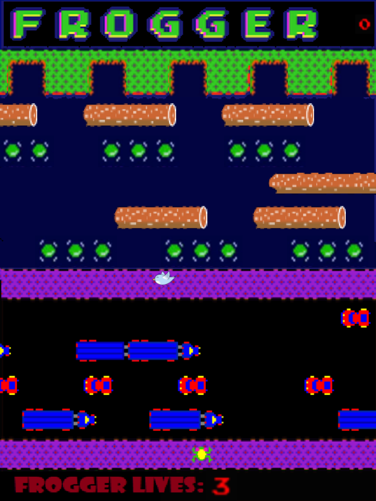

# **_Frogger Software Maintenance_**

This Program is reintroduces an Arcade game called "Frogger". Although its similar to the orignal game they are not exactly the same as you will find additions in this version.

## Getting Started

These instructions will ensure that the program can get up and running on your local machine for development and tests.

#### Running the game
~~~~
NOTE: not tested in command line as maven is integrated into IntelliJ

load the project into the IntelliJ IDE, and set the correct configurations.
This can be done by setting the Main class to com.mainPack.Main in
the "Edit Configurations" next to the run button and add a maven goal
in the build. Enter "clean compile test" and it allows for automated testing
by pressing apply.

Versions used:
    - Java 10 
    - Maven
    - IntelliJ IDEA 2019.2.4 x64
~~~~

## Extensions

### Highscores
Highscores were implemented for the overall score of the level being played and displayed to the user in a sorted fashion (Descending).

### Further Levels
Further level implementation was allowed once the main class was refactored to put the level being played into an abstract class that could be overridden to alter the game.

Image below shows the new rendition of a bird added and each turtle being a wetTurtle

### JUnit
JUnit Tests include:
~~~~
1) Keypad pressed tested to see frogger moves properly
2) Checks whether objects in the game have been set properly and move
3) Checks whether images have been set properly for the objects
4) Tests whether points are set, added and removed appropriately
5) Read and write are each tested to see if they perform their actions 
   properly
6) Bubblesort in ordering highscores tested
7) Boundary tests written
8) Checks touching water causes death
   etc..
~~~~
### Start Menu
Start menu added to greet the user when they play the game. They can either choose a level or see how the game works by pressing game information

### Other Additions:
~~~~
1) Frogger Lives added
2) CSS added to alerts and buttons
3) Highscore at the end of each round sorted (descending)
~~~~
## Refactoring
### Maven
Maven build files allow for everything to be imported through maven and as such does not have any dependencies on source code outside its control. 
### Design Patterns
##### Singletons:
~~~~
1) Singleton added for the BackgroundImage class.
2) Singleton added for the HighScoreRW class to read and write highscores.
3) Singleton added for the StartMenu class as only created once and called when
   the game ends.
~~~~
##### Factories:
~~~~
1) Factory added for Levels in the game.
2) Factory added for objects moving in the game e.g. Logs, Turtles etc...
~~~~
### Bug Fixes
Bug fixes include the following:
~~~~
1) Moving into the end that has already been activated - frogger is
   no longer allowed.
2) speed of logs or turtles to speed up and have the frogger
   not slip off the log with the new speed.
~~~~

### Other refactorings
~~~~
1) Added abstract moving class for dircection movement of objects
2) Made WetTurtle extend Turtle instead of Actor
3) Encapsulated fields especially those used for tests
~~~~
